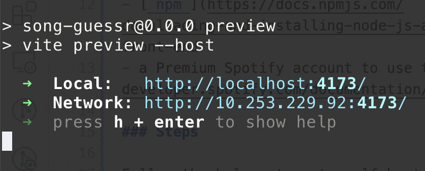
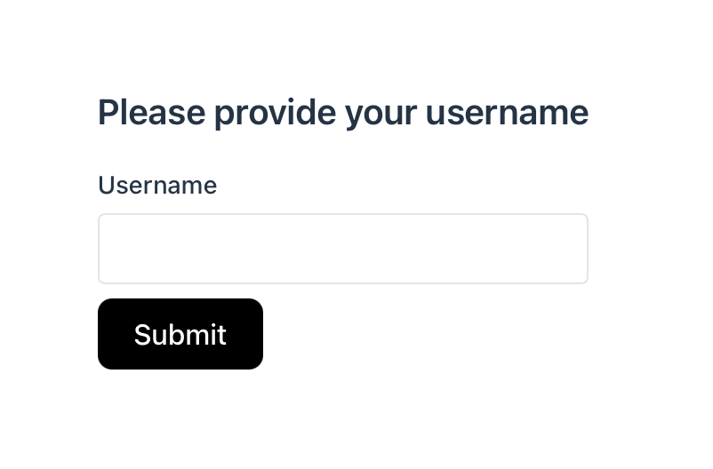
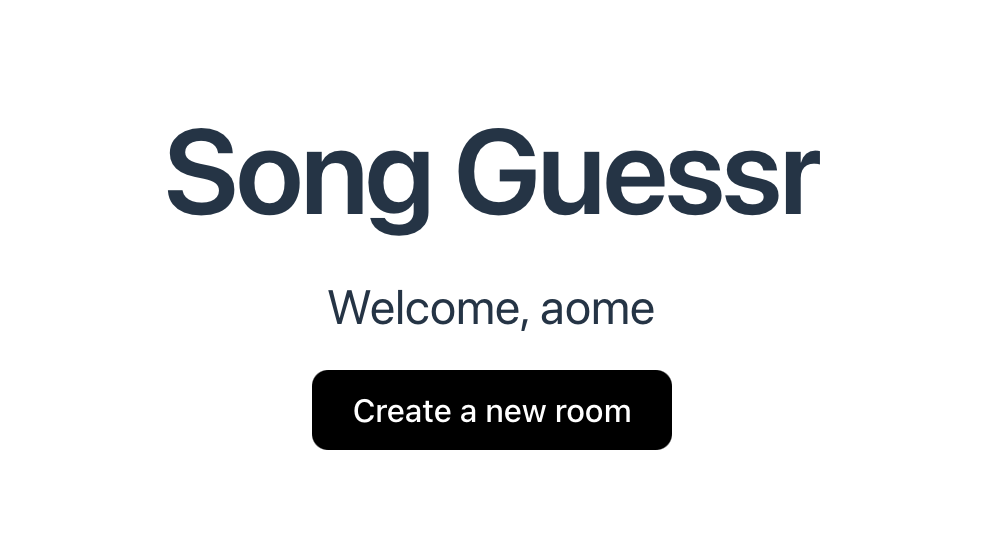
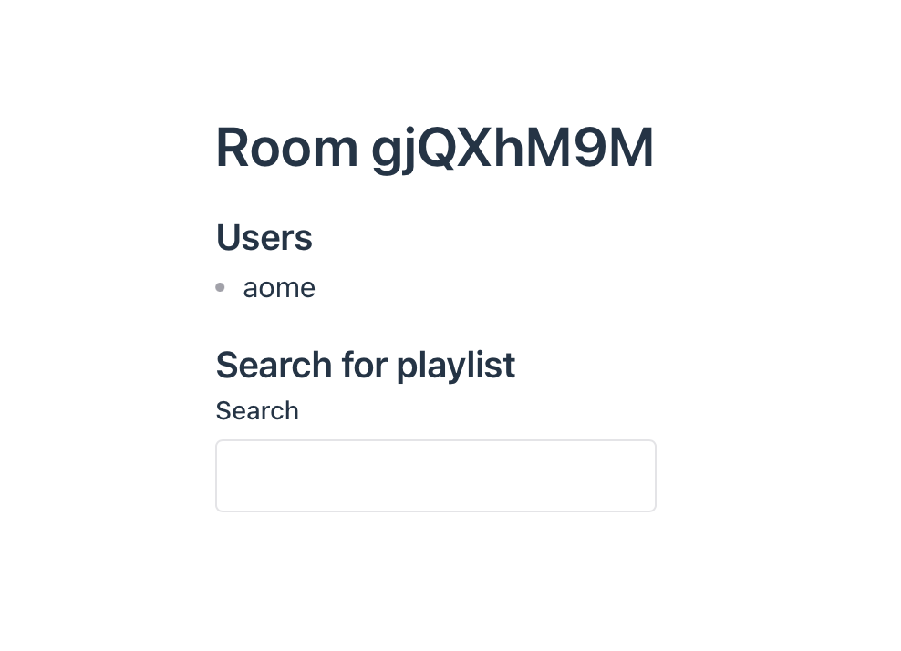
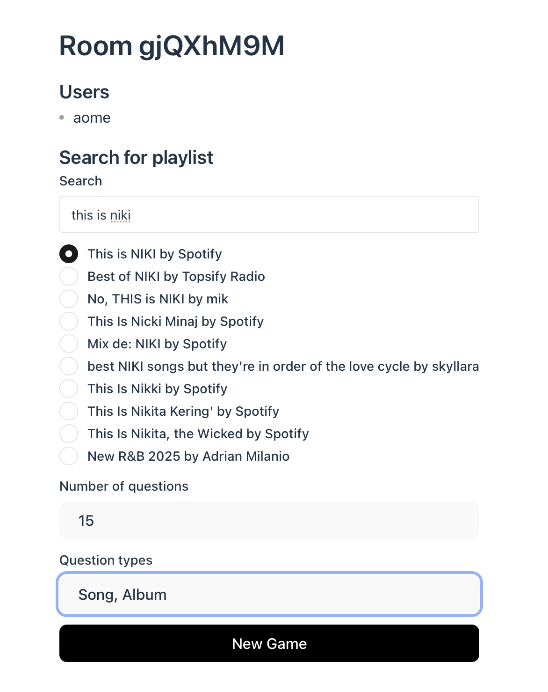
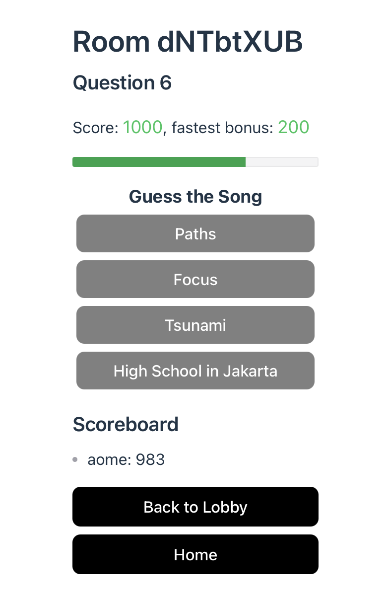

# Song Guessr

Song Guessr is a multiplayer game where players compete to identify songs from short audio snippets. Each round challenges players to guess details such as the song title, artist, or album. Points are awarded based on accuracy and speed, making every round an exciting test of musical knowledge and quick thinking.

## Table of Contents

- [Self-hosting the Game](#self-hosting-the-game)
  - [Requirements](#requirements)
  - [Building and Running the Game](#building-and-running-the-game)
- [Gameplay](#gameplay)
- [Development](#development)

## Self-hosting the Game

Currently, the project requires users to **self-host** both the game server and client.

### Requirements

- [`Rust`](https://www.rust-lang.org/tools/install) for the game's back-end
- [`npm`](https://docs.npmjs.com/downloading-and-installing-node-js-and-npm) for the game's front-end
- A Premium Spotify account to authorize application access to [Spotify Web APIs](https://developer.spotify.com/documentation/web-api)

### Building and Running the Game

Follow these steps to self-host the game

1. Clone the project repository:
   ```shell
   git clone https://github.com/aome510/song-guessr.git
   ```
2. Install dependencies and build the front-end:
   ```shell
   npm install && npm run build
   ```
3. Serve the game's website:

   ```shell
   npm run preview -- --host
   ```

   

   The game's website will be accessible via the **network** URL.

   **NOTE**: This link can be shared with friends **connected to the same network** to access the game's website.

4. Build and run the server: open a new terminal tab and execute:

   ```shell
   cargo run --release
   ```

   When running the server for the first time, it will open a web page in your default browser, requesting permission to access your Spotify data (e.g., playlists). You should see a page similar to this:

   

   Click **Continue to the app** to authorize API access. If you are redirected to a page displaying **"Go back to your terminal 😊"**, the game's server has been successfully set up.

5. Visit the [Gameplay section](#gameplay) to learn how to create rooms and play the game with your friends.

### Gameplay

When you first visit the game's website, you will be prompted to create a user profile.



Once your profile is created, you will be directed to the homepage.



Click **Create a new room** to generate a game room. You will be redirected to a dedicated room page.



Your friends can join the room using the provided URL (e.g., `http://10.253.229.92:4173/room/gjQXhM9M`). The **Users** section displays all active participants.

Quizzes are generated based on songs from a specific Spotify playlist. Use the search bar to find a playlist of your choice.



You can adjust the number of questions and question types (e.g., song's name, album, artist, etc.). Click **New Game** to begin.



Each round features a short snippet of a song. Depending on the question type, you must guess the correct song title, artist, or album.

Scores are based on accuracy and response time. Additionally, bonus points are awarded to the **fastest correct** answer.

## Development

### Back-end Development

Build and run game's server in a debug mode:

```shell
cargo run
```

### Front-end Development

Install the front-end dependencies:

```shell
npm install
```

Run the game's website in developement mode:

```shell
npm run dev -- --host
```
